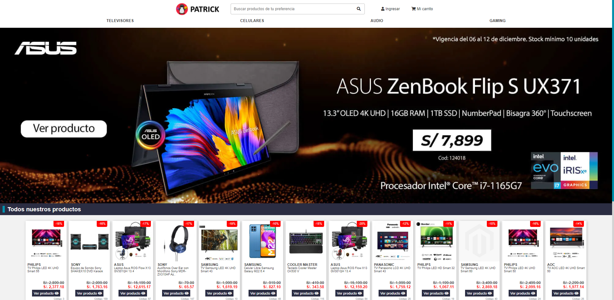

<!-- header -->

  

<h1 align="center">
  Tienda Online Rios V1.0
</h1>

 
    Online Store + DataBase created from scratch.

<!-- main -->

  

<!-- ejecución del proyecto -->
<h2>
    &#128193
    Ejecutar el proyecto
</h2>

Para ejecutar este proyecto en tu ordenar sigue los siguientes pasos:

<ol>
    <li>
        Tener instalado 
        <a href='https://www.apachefriends.org/es/index.html' target='_blank'>
            Xampp
        </a>(servidor local, base de datos)
    </li>
    <li>
        Descargué el proyecto y cambie el nombre de la carpeta a 
        <strong>Tienda_Online_Rios</strong>.
    </li>
    <li>
        Diríjase a la carpeta <strong>htdocs</strong> de xampp y coloque la carpeta <strong>Tienda_Online_Rios</strong>.
        
    </li>
    <li>
        Ejecute este archivo en su gestor de base de datos favorito.
        
    </li>
    <li>
        Ahora solo debes ejecutar el archivo index.php en tu navegador y listo.
    </li>
</ol>

    &#128073; My Youtube Channel &#127909;
    <a href="https://www.youtube.com/c/angelox2Patrick" target="_blank">angelo x2</a>

    &#128073; Facebook Page &#128153;
    <a href="https://www.facebook.com/Programador347-101320832263307" target="_blank">programador347</a>

<h3>
    &#128736 
    Created by:
</h3>
<ul>
    <li>
        Joel Ferrer
    </li>
    <li>
        Luis Fernando
    </li>
    <li>
        Miguel Ángel
    </li>
    <li>
        Angelo Patrick
    </li>
</ul>