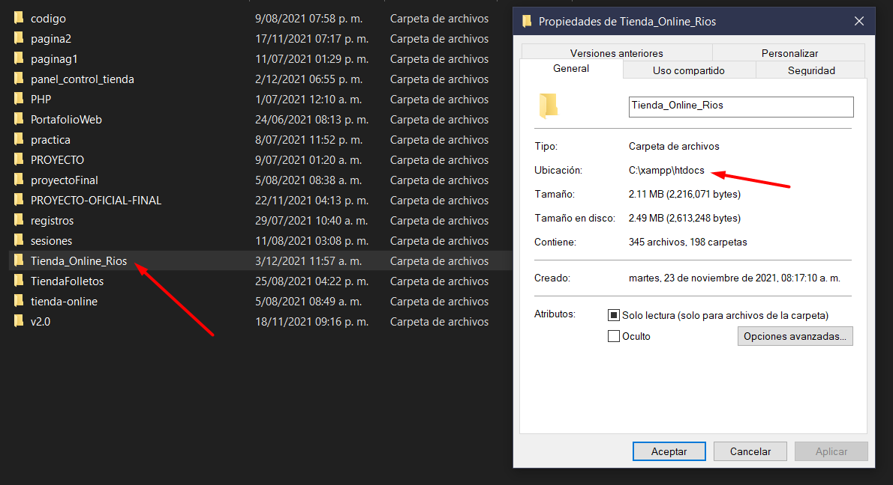
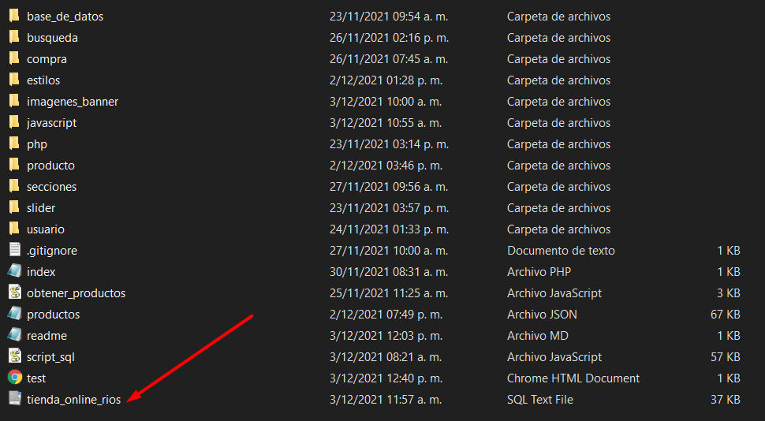

<h1>TIENDA ONLINE</h1>
<h3>Para ejecutar este proyecto en tu ordenar sigue los siguientes pasos:</h3>
<ol>
    <li>
        Descargar el proyecto y cambiar el nombre de la carpeta a <strong>Tienda_Online_Rios</strong>.
    </li>
    <li>
        Ir a la carpeta <strong>htdocs</strong> del xampp y copiar la carpeta <strong>Tienda_Online_Rios</strong>.
        
    </li>
    <li>
        Ejecutar el sql en el motor de base de datos que tengan.
        
    </li>
    <li>
        Ahora solo debes ejecutar el archivo index.php en tu navegador y listo.
    </li>
</ol>